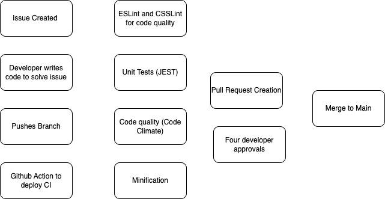

# Team 22 CI/CD Pipeline Phase 2

## Overview 

Our pipeline is designed to quickly and effenciently deploy new code while testing it for bugs. We have the following tools and processes outlined for our pipeline.
We want to implement the following tasks in the section below for our pipeline so that we are able to check the code that is being merged and make sure it is clean and neat and held to a standard. Using the features we list below we can continue development (CI) so that we have no hold ups in the development process.

# Identified New Pipeline Features
- CSS linting and code style enforcement
- Documentation generation via automation (ex. JSDocs)
- Pull Requests need to be talked about more with members of team
- Demonstrate ESLint and Unit Test to team as well so they understand it better

### CSS and ES Linting
We have also implemented CSSLinting since our phase 1 to go along with our ESLint that we had done. 

**Methods of using CSSLinting**
1. Fill in this portion

**Methods of using JSDocs** 
1. Follow the example comment below and this will allow us to use the configuration file made to auto-generate documentation based on the comments after they are done. Have members of the team write these comments for each function they write so that we can generate documentation for it. 
/**
 * Represents a book.
 * @constructor
 * @param {string} title - The title of the book.
 * @param {string} author - The author of the book.
 */

**Pull Requests**
1. These are manual and need to be done by individual members of the team. Go to github and check on pull requests that are waiting to be merged. Take these requests and view the changes made to the main code-base and see if there are any errors. Once you have combed through the request and identified any bugs, you can submit your review so that it can be approved or fixed before it is pushed to the main branch. 

**Phase 2 Pipeline Diagram**

**Review from last time**

**Methods of using ESLinting:**
1. Install ESLint extension on VSCode for live error scan. We recommended everyone on our team to install this extension so we can view the error live and practice our coding conventions more efficiently.

2. Run `npm run lint` in terminal. We also implemented lint in npm scripts so it can scan the appropiate folders and files.

### Unit Testing
We are continuing on using **Jest** for unit testing.

**Procedure of using Jest:**
1. Create the unit tests for the function that you will work on in the Jest folder.
2. Implement the function.
3. Run `npm test -- [filename.test.js]` in terminal to test a single file.
- or -
3. Run `npm test` in terminal. We have already implemented test in npm scripts so it can test all unit tests.

## Pipeline Diagram

