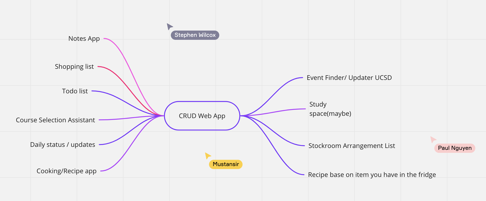
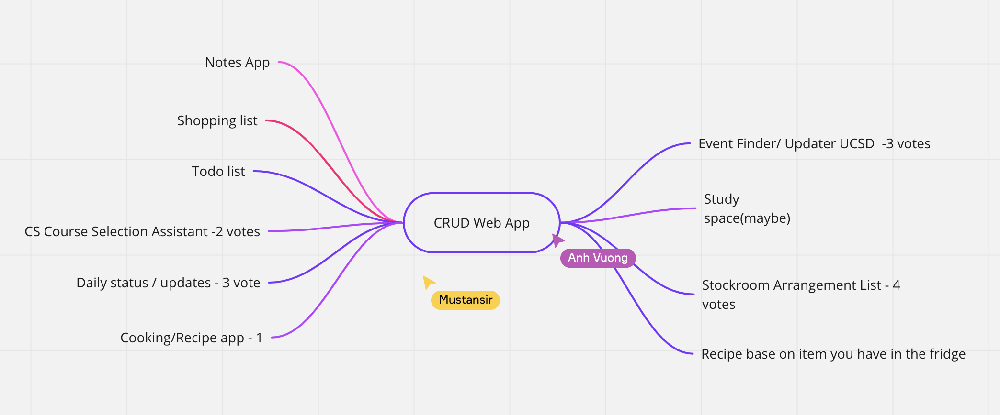

# Team 22 Meeting Minutes
## Type of meeting - Brainstorming Meeting #2

**Meeting Date/Time:**   Second Meeting: 10/19/22 4:00 PM

**Meeting Purpose:**   Brainstorming

**Meeting Location:**   Zoom Call

**Note Taker:** Varun Singhal

**Meeting End Time:** 10/19/22 5:00 PM

## Attendance List
- Varun Singhal
- Mustansir Taquee
- Anh Vuong
- Jack Chou
- Paul Nguyen
- Stephen Wilcox
- Subash Katel
- Yaohui Chen   
- Zijian Su
  
Absentees?
N/A

## Agenda Items 
1. Use Miro and start brainstorming with the team
2. Get members on the same page regarding ideas and brainstorming ideas for the CRUD app.
3. Vote on the ideas and look towards how we can develop it.

## Brainstorming Ideas / Notes

## Additional Information / Comments
Domain: Informational Management
CRUD App
HTML, CSS, JavaScript (Web development) 
Arch: Local first, Remote second - storage 

Examples: Notes app (Mustansir), Shopping list (Yahoo), Event Update Page Board (Subash)
Event Update Page - Used for students to find events at school since there are so many events and unoficial events that students would want to look at and maybe participate in. 
Study Space - For arrangement of notes and study space and where you are able to store your notes and where you are. 
Stockroom Arrangement List - Whenever you go shopping and buy a lot of stuffs but you don’t really remember if you bought it yet or not, the list will help you know you have the stuffs in your stock or not. Moreover, this list can show you where you arrange your stuffs at home
Recipe Based on Item in fridge - List of recipes in your phone, start writing out some items and figure out what recipes are possible based on the ingredients you already have. 
Cooking Recipe App - Community to share easy ideas and recipes to people so they can see and review and like it.
Daily Status / Updates - An app where students are able to provide random status updates of the things around them, funny things that happen to them, etc... all anonymous and allows for users to create and read these updates and interact update and delete them. 
CS Course Selection - input courses and hels
Todo List - Allows for users to add things to the to-do list, and the app will give you encouragement as you finish tasks. Set priority for the certain task 
Shopping List - Shopping list for people to update what they are looking to shop for, what they have already gotten, etc..
Notes app - Simple CRUD app for people to create notes. 

## Important Notes / Decisions
- What is the local aspect of the app vs the remote aspect? And does this have to do with the user’s data and how we are storing it? What does “Arch: Local first, remote second” mean.
- What is our app allowed to do in terms of internet? Should our app be solely reliable on the internet or should it work without flaw even without internet access. Should the data for the user be stored locally or should it be stored on the cloud?
- 
- We voted on ideas, look at the picture to see votes for each of the ideas. 
- Meeting we will decided after insight from Navya
