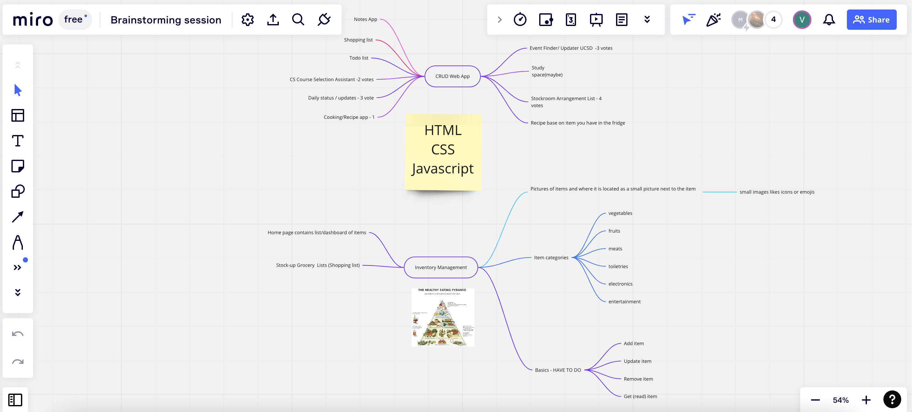

# Team 22 Meeting Minutes
## Type of meeting - Brainstorming Meeting #3

**Meeting Date/Time:**   Second Meeting: 10/21/22 2:55 PM

**Meeting Purpose:**   Brainstorming #3

**Meeting Location:**   Zoom Call

**Note Taker:** Varun Singhal

**Meeting End Time:** 10/21/22 4:00 PM

## Attendance List
- Varun Singhal
- Mustansir Taquee
- Anh Vuong
- Jack Chou
- Paul Nguyen
- Stephen Wilcox
- Subash Katel
- Yaohui Chen   
- Zijian Su
  
Absentees?
Yaohui Chen (Class - Excused)

## Agenda Items 
1. Go over 3 ideas
2. Narrow in on one of the ideas
3. Go over roles for the idea  
4. Go over the look for the idea and etc... (Ideas / Notes)

## Ideas / Notes
- Competitors: Sticky Notes / Notes
  
- Color/Theme: Green / Purple / Yellow / White / Black - Homegood vibes (like you walk into the home aisle of Macy's)
   
- Mood/Metaphor: Homegood Vibes 
  
- Features (With priority): 
  1. BASICS: CRUD (1. Create, 2. Read, 4. Update, 3. Delete)
  2. Categories for items (Allows for ease of user experience to quickly catalog certain items)
  3. Icons for the items (Allows for user to see what they have quickly - ease of experience)
  4. Shopping list of what to get (This will allow for a quick add to inventory when the shopping trip has completed)
  5. Storage space list (Allows user to see where the item is in their home)
  
- Target Audience: Moms, Chefs, Students, Home-owners, butlers, people who buy grocerries - essentially people who need to organize their homes and figure out the items they have and what they need. Once they get what they need they can add it to their app and it will add it to their inventory. 
  
- What do users want? Users want an app that will allow them to organize their homes and take into account items they already have or have bought on previous trips to the store. 

## Additional Information / Comments
- Used Miro for drawing features and ideas relating to inventory management

## Important Notes / Decisions
- Inventory Management is the idea we have narrowed in on  
- Check Notes section for ideas based on the app and how we want it to look like.

Backend
- Jack Chou
- Yaohui Chen
- Subash Katel (if needed)
- Stephen Wilcox

Frontend
- Zijian Su 
- Anh Vuong
- Subash Katel

No Preference: 
- Varun Singhal
- Mustansir Taquee
- Paul Nguyen

- Write down a personal statement on a time where this app would have been useful to you. How did a competitor app (notes) not solve your problem?
- What could be better about the notes app?

